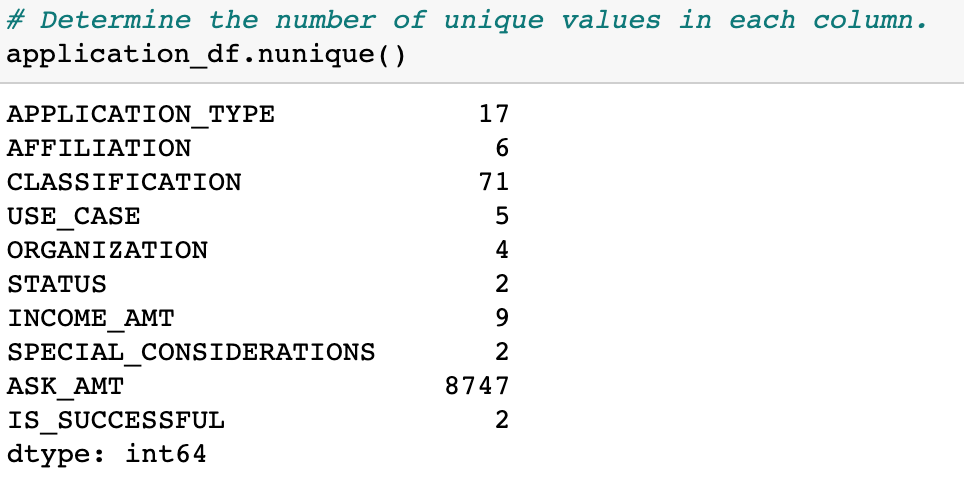
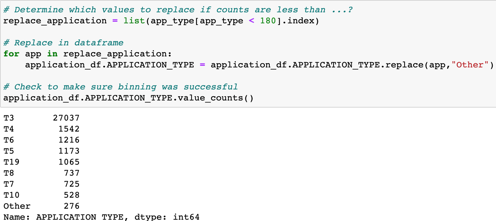
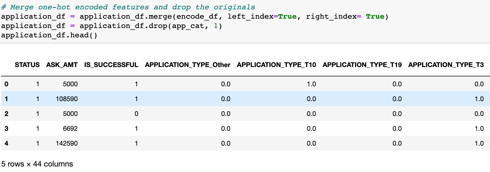
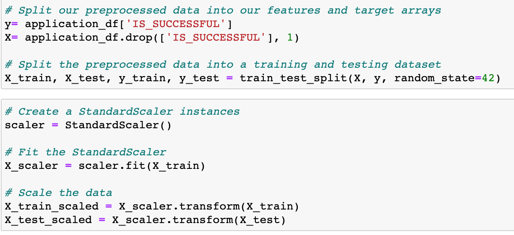

# Neural_Network_Charity_Analysis
## Project Overview
Working for a nonprofit charity organization, the goal of this project is to build a machine learning model that will successfully determine which groups and applicants for a grant will be successful, and which will be denied. Using the Python TensorFlow library, we will build a deep learning model to help our organization decide where to make investments. Through the preprocessing steps of encoding and standardizing the data, we will prepare it for our model. Then we will develop, train, and fit a Machine Leaning model for our analysis.

## Resources
Software Used: Python 3.8.8, Pandas, Jupyter Notebook, Virtual Studio Code 1.57.0   
Data Source: charity_data.csv (file with 34,000 organizations that have received funding in the past)

## Preprocessing
* To preprocess the data, the categorical variables need to be encoded, and binned or bucketed appropriately. We used the .nunique() method to determine which variables needed to be binned before encoding, finding that the "Application_Type" and "Classification" variables have enough unique values to warrant binning.
    * 
* The below code demonstrates the process of binning the "Application_Type" variable, putting all values less than 180 into the "Other" category.
    * 
* Once the two previously identified variables have been beened, OneHotEncoding was used to translate all categorical variables into integer data. This encoded dataframe was then merged with the original dataframe, and the original categorical columns were dropped.
    * 
* Finally, using the StandardScaler, the data was standardized and split into training and test data sets.
    *   
    
## Analysis

## Summary
