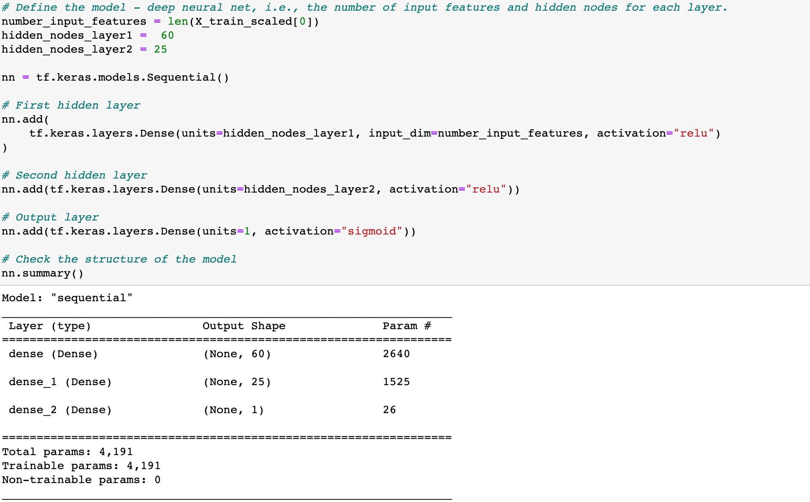
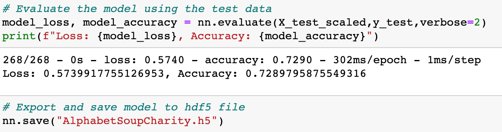
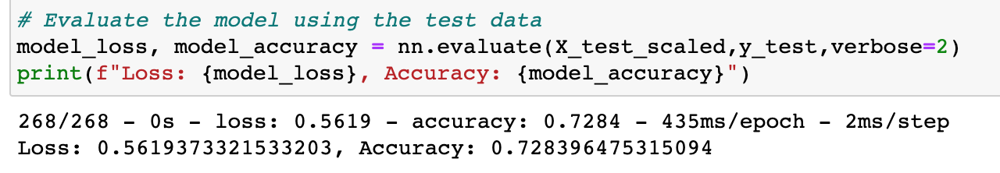
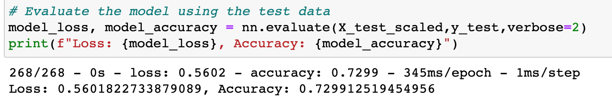
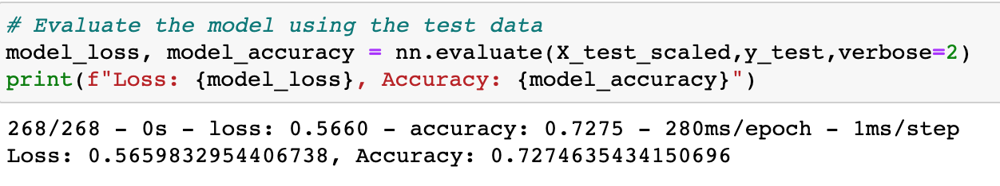

# Neural_Network_Charity_Analysis
## Project Overview
Working for a nonprofit charity organization, the goal of this project is to build a machine learning model that will successfully determine which groups and applicants for a grant will be successful, and which will be denied. Using the Python TensorFlow library, we will build a deep learning model to help our organization decide where to make investments. Through the preprocessing steps of encoding and standardizing the data, we will prepare it for our model. Then we will develop, train, and fit a Machine Leaning model for our analysis.

## Resources
Software Used: Python 3.8.8, Pandas, Jupyter Notebook, Virtual Studio Code 1.57.0   
Data Source: charity_data.csv (file with 34,000 organizations that have received funding in the past)

## Preprocessing
* To preprocess the data, first we wanted to drop the irrelevant "Name" and "EIN" columns.
* Then the remaining categorical variables need to be encoded, and binned or bucketed appropriately. We used the .nunique() method to determine which variables needed to be binned before encoding, finding that the "Application_Type" and "Classification" variables have enough unique values to warrant binning.
    * 
* The below code demonstrates the process of binning the "Application_Type" variable, putting all values less than 180 into the "Other" category.
    * 
* Once the two previously identified variables have been beened, OneHotEncoding was used to translate all categorical variables into integer data. This encoded dataframe was then merged with the original dataframe, and the original categorical columns were dropped.
    *   

* In the below code the "IS_SUCCESSFUL" variable was declared as the target variable. This was then dropped from our dataframe for our features.
* Finally, using the StandardScaler, the data was standardized and split into training and test data sets.
    *   

## Analysis
* First we created a neural network with two hidden layers. This model was then compiled and fit. Reults are below. We also saved the models weights every 5 epochs, and saved those results. See code for the model and the evaluation below.
    * 
    * 
* There were two hidden layers, with 60 and 25 neurons respectively. The "Relu" activation function was used for the two hidden layers, and the "sigmoid" function was used for the output layer. The output function was chosen because we are looking for binary classification outputs, and the Sigmoid function best fits those needs.

## Optimization
* Because the model was only 73% accurate, and our threshold was 75%, the model needs to be optimized.  
* First to attempt to reach the desired threshold, the number of categories were reduced in the binning process for both Application Type and Classification. The resulting output, which was actually less accurate than the original model, is below.
    * I attempted to decrease the Application_type[Other] class to those less than 700, and the Classification[Other] to those less than 2000.
    * 
* Since it seems the categories did not make the model more accurate, we will try to add an additional hidden layer. This time our accuracy was still essentiall 73%, and does not meet the threshold.
    * I added a third hidden layer with 8 neurons and the relu activation function.
    * 
* For the third attempt at optimization, I kept the third hidden layer, but increased the number of neurons in each layer to 85, 35, and 12 respectively.
    * Once again this fails to incresae the accuracy of the model, as seen below.
    * 
## Summary
Unfortunately the model never reached the 75% accuracy threshold, but with more tweaking of the model I am confident we could get there. Other ways to optimize that were not tried include getting rid of more unnecessary columns in the preprocessing phase, or changing the activation functions used within the neural network.

